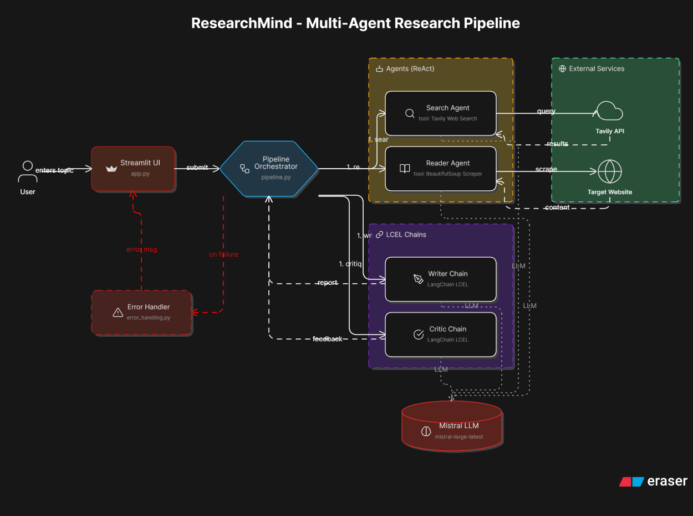
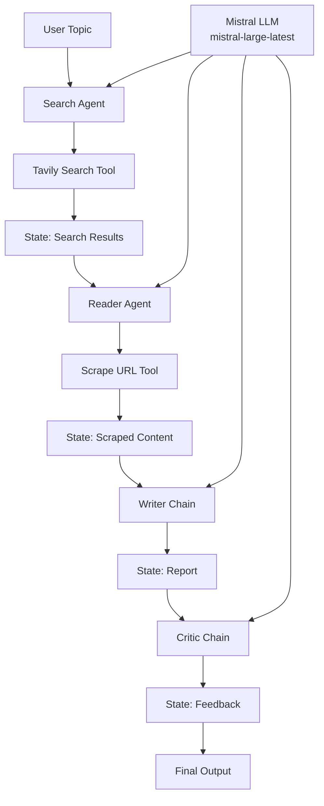

# ResearchMind
Multi-agent AI research workflow built with LangChain, Mistral, Tavily, and Streamlit.


## Overview
ResearchMind takes a topic and runs a 4-step pipeline:
1. Search web results.
2. Scrape a relevant source for deeper content.
3. Write a structured research report.
4. Critique the report with score and improvements.

The project supports:
- CLI execution (`pipeline.py`)
- Streamlit UI execution (`app.py`)

## Architecture



## Features
- Search agent using Tavily (`web_search` tool).
- Reader agent using BeautifulSoup scraping (`scrape_url` tool).
- Writer chain for report generation.
- Critic chain for quality review.
- Shared Mistral LLM configuration in `agents.py`.
- Downloadable markdown report from Streamlit UI.

## Tech Stack
- Python 3.12+
- LangChain (`langchain`, `langchain-core`, `langchain-community`)
- `langchain-mistralai`
- Streamlit
- Tavily API
- BeautifulSoup + Requests
- `python-dotenv`
- `uv` for dependency management

## Pipeline Flow



## Project Structure
```bash
multi-agent-research-system/
├── agents.py        # LLM setup + agent builders + writer and critic chains
├── tools.py         # web_search and scrape_url tools
├── pipeline.py      # CLI pipeline runner
├── app.py           # Streamlit app
├── error_handling.py # Error normalization utilities
├── assets/
│   └── architecture.png
├── pyproject.toml   # dependencies and project metadata
├── uv.lock          # lockfile for reproducible installs
└── README.md
```

## Setup

1. Clone repository
```bash
git clone <your-repo-url>
cd multi-agent-research-system
```

2. Install dependencies
```bash
uv sync
```

3. Create `.env` and add keys
```env
MISTRAL_API_KEY=
TAVILY_API_KEY=
```

## Run

### CLI
```bash
uv run pipeline.py
```

### Streamlit
```bash
uv run streamlit run app.py
```

## Notes
- `agents.py` reads `MISTRAL_API_KEY` from `.env` via `python-dotenv`.
- All 4 agents and chains share a single lazily-initialized `ChatMistralAI` instance.
- Pipeline state is in-memory per run.
- No database or REST API is implemented in the current repo.